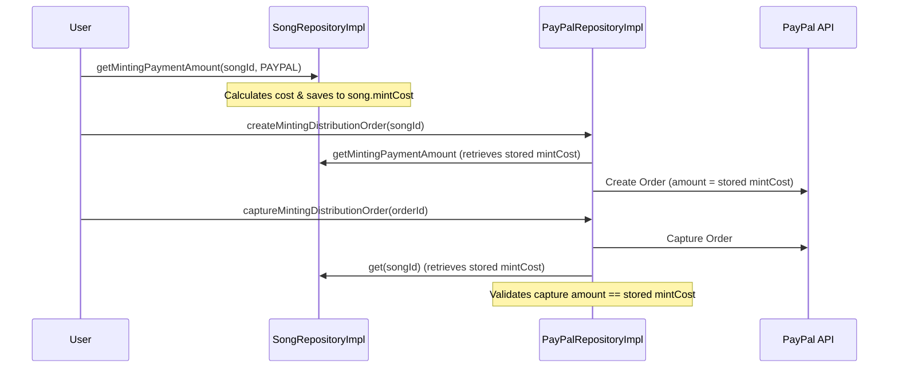

# SOP: PayPal Price Security

## Key Principle

The `mintCost` for a song is calculated and stored in the database when `getMintingPaymentAmount()` is first called. Subsequently, all operations, including PayPal order creation and capture validation, must consistently use this single, stored `mintCost` from the database to prevent pricing discrepancies or tampering.

## Correct Flow



## Implementation Details

### 1. Persistence in `getMintingPaymentAmount()`

In `SongRepositoryImpl.kt`, the total cost for the selected `paymentType` is calculated and saved to the `Song` entity.

```kotlin
// SongRepositoryImpl.kt
override suspend fun getMintingPaymentAmount(songId: SongId, paymentType: PaymentType): MintPaymentResponse {
    // ... calculate response
    return response.also { paymentResponse ->
        val totalCostPayPal = paymentResponse.mintPaymentOptions
            .first { it.paymentType == PaymentType.PAYPAL }
            .price.toBigDecimal().movePointRight(6).toLong()

        update(songId, Song(
            mintPaymentType = paymentType.name,
            mintCost = when (paymentType) {
                PaymentType.PAYPAL -> totalCostPayPal
                // ... other types
            }
        ))
    }
}
```

### 2. Validation in `captureMintingDistributionOrder()`

In `PayPalRepositoryImpl.kt`, the captured amount is strictly compared against the `mintCost` retrieved from the database.

```kotlin
// PayPalRepositoryImpl.kt
val song = songRepository.get(songId)
if (song.mintPaymentType != PaymentType.PAYPAL.name) {
    throw HttpUnprocessableEntityException("Unexpected payment type for songId=$songId: ${song.mintPaymentType}")
}
val storedPriceMicroUsd = song.mintCost
    ?: throw HttpUnprocessableEntityException("No stored mint cost found for songId=$songId")
val expectedPrice = storedPriceMicroUsd.toBigInteger().toAdaString().toBigDecimalUsd()

if (amount.currencyCode != "USD" || amount.value.setScale(2, RoundingMode.HALF_UP) != expectedPrice) {
    throw HttpUnprocessableEntityException(
        "Unexpected capture amount - expected $expectedPrice USD, received: ${amount.value} ${amount.currencyCode}"
    )
}
```

## Files

- [SongRepositoryImpl.kt](file:///home/westbam/Development/newm-server/newm-server/src/main/kotlin/io/newm/server/features/song/repo/SongRepositoryImpl.kt)
- [PayPalRepositoryImpl.kt](file:///home/westbam/Development/newm-server/newm-server/src/main/kotlin/io/newm/server/features/paypal/repo/PayPalRepositoryImpl.kt)

---
**Updated:** 2025-12-30
