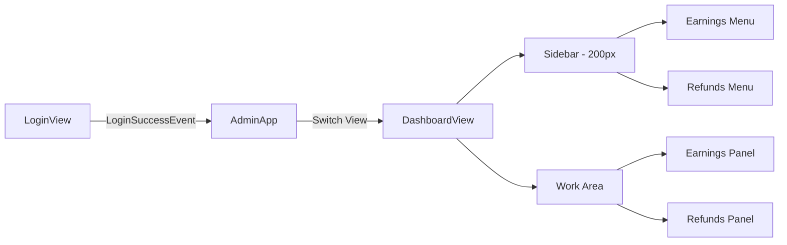

# NEWM Admin Desktop Application

## Overview

NEWM Admin is a desktop application for internal administrators to manage the NEWM platform. Built with Rust and GPUI (GPU-accelerated UI framework from Zed), it provides a performant, native interface for admin operations.

**Tech Stack:**
- **Language:** Rust (2024 edition)
- **UI Framework:** GPUI + gpui-component
- **HTTP Client:** reqwest with async-compat bridge
- **Target Platform:** Desktop (Linux, macOS, Windows)

---

## Current Features

### ✅ Authentication

**Status:** Completed (2026-01-07)

| Feature | Description |
|---------|-------------|
| Admin Login | Email/password authentication against Garage/Studio APIs |
| Environment Selection | Toggle between Garage (dev) and Studio (prod) environments |
| JWT Validation | Verifies `admin: true` claim in JWT before allowing access |
| Password Visibility Toggle | Eye icon to show/hide password input |

**Files:**
- [auth.rs](file:///home/westbam/Development/newm-server/newm-admin/src/auth.rs) — HTTP authentication client
- [jwt.rs](file:///home/westbam/Development/newm-server/newm-admin/src/jwt.rs) — JWT claims parsing
- [login.rs](file:///home/westbam/Development/newm-server/newm-admin/src/views/login.rs) — Login view UI

---

### ✅ Admin Dashboard

**Status:** Completed (2026-01-07)

| Feature | Description |
|---------|-------------|
| Sidebar Navigation | 200px fixed sidebar with menu items |
| View State Management | Event-driven switching from Login → Dashboard via `LoginSuccessEvent` |
| Menu Items | Earnings (`IconName::ChartPie`), Refunds (`IconName::Undo`) |
| Dynamic Work Area | Content changes based on selected menu |
| Mock Statistics Cards | Placeholder cards showing sample data |

**Architecture:**



**Event-Driven View Switching:**
- `LoginView` emits `LoginSuccessEvent` on successful authentication
- `AdminApp` subscribes to this event and switches `AppView` enum from `Login` to `Dashboard`
- This pattern allows decoupled views and clean state management

**Files:**
- [app.rs](file:///home/westbam/Development/newm-server/newm-admin/src/app.rs) — App state, view switching, event subscription
- [dashboard.rs](file:///home/westbam/Development/newm-server/newm-admin/src/views/dashboard.rs) — Dashboard view with sidebar and work area
- [colors.rs](file:///home/westbam/Development/newm-server/newm-admin/src/colors.rs) — Shared color palette

---

## Planned Features

### 🔲 Earnings Management

**Priority:** High

#### API Endpoints

The admin app uses JWT-protected admin endpoints from the backend:

| Endpoint | Method | Purpose |
|----------|--------|---------|
| `/v1/earnings/admin` | GET | Fetch all earnings records |
| `/v1/earnings/admin` | POST | Batch create earnings (accepts `List<Earning>`) |
| `/v1/earnings/admin` | DELETE | Delete earnings by IDs (accepts `List<UUID>`) |
| `/v1/earnings/admin/{songIdOrIsrc}` | GET | Get earnings by song ID or ISRC |
| `/v1/earnings/admin/{songIdOrIsrc}` | POST | Create royalty splits for a song |

**Earning Model Fields:**
- `id` (UUID), `songId` (UUID), `stakeAddress`, `amount` (Long, 6 decimals)
- `memo`, `startDate`, `endDate`, `claimed`, `claimedAt`, `claimOrderId`
- `createdAt`, `nftPolicyId`, `nftAssetName`

**AddSongRoyaltyRequest:** Either `newmAmount` or `usdAmount` (BigInteger, 6 decimals)

---

#### UI Components

##### Summary Boxes

Three summary cards at the top of the Earnings dashboard, calculated from the filtered data:

| Box | Description | Calculation |
|-----|-------------|-------------|
| **Total Earnings** | Sum of all earnings in current filter | `Σ earning.amount` |
| **Claimed Earnings** | Sum of claimed earnings | `Σ earning.amount WHERE claimed == true` |
| **Unclaimed Earnings** | Sum of unclaimed earnings | `Total - Claimed` |

> [!NOTE]
> All amounts display in NEWM tokens with 6 decimal places, prefixed with `Ɲ` symbol (e.g., `Ɲ 1,234.567890`).

##### Earnings Table

A sortable, filterable table displaying all earnings:

| Column | Sortable | Filterable | Notes |
|--------|----------|------------|-------|
| ID | ❌ | ❌ | UUID |
| Song ID | ✅ | ✅ | UUID or display song title if available |
| Stake Address | ✅ | ✅ | Cardano stake address |
| Amount | ✅ | ❌ | Display as `Ɲ X.XXXXXX` |
| Memo | ❌ | ✅ | Freeform text |
| Claimed | ✅ | ✅ | Boolean (checkbox filter) |
| Claimed At | ✅ | ❌ | DateTime, null if unclaimed |
| Created At | ✅ | ✅ | DateTime (supports date range filter) |

**Table Features:**
- **Refresh Button:** Fetches latest data from server
- **Date Range Filter:** Filter by `createdAt` date range (critical requirement)
- **Infinite Scroll:** Virtual list handles large datasets efficiently

##### Toast Notification System

A toast notification system to inform users of API operation results:

| Toast Type | Behavior | Auto-Dismiss |
|------------|----------|--------------|
| **Success** | Green background, checkmark icon | 5 seconds |
| **Warning** | Yellow/orange background, warning icon | Manual X close required |
| **Error** | Red background, error icon | Manual X close required |

Toast content should include:
- Clear message describing success or failure
- For failures: Include error message from API response
- Position: Top-right corner of the work area, stacked if multiple

---

#### Workflows

##### Add Earnings (Single Song)

**Button:** "Add Earnings" in the toolbar

**Dialog Fields:**
| Field | Type | Description |
|-------|------|-------------|
| Song ID or ISRC | Text input | Accepts UUID or ISRC format (e.g., `IE-LOI-23-01693`) |
| Amount (USD) | Decimal input | User enters USD value (e.g., `10.50`) |

**Process:**
1. User enters songId/ISRC and USD amount
2. Convert amount to 6-decimal integer: `10.50` → `10500000`
3. Call `POST /v1/earnings/admin/{songIdOrIsrc}` with `{ usdAmount: 10500000 }`
4. On success: Show success toast, refresh table
5. On failure: Show error toast with API error message

##### Upload Earnings CSV

**Button:** "Upload CSV" in the toolbar

**CSV Format (Input):**
```csv
songId_or_isrc,amount_usd
550e8400-e29b-41d4-a716-446655440000,10.50
IE-LOI-23-01693,25.00
```

**Process:**
1. User selects CSV file via native file picker
2. Parse CSV, validate format (2 columns required)
3. For each row:
   - Convert USD to 6-decimal integer
   - Call `POST /v1/earnings/admin/{songIdOrIsrc}`
   - Record result (success or error message)
4. Modify CSV to add result column
5. Save modified CSV with results

**CSV Format (Output):**
```csv
songId_or_isrc,amount_usd,result
550e8400-e29b-41d4-a716-446655440000,10.50,Success
IE-LOI-23-01693,25.00,Error: No song found with ISRC: IE-LOI-23-01693
```

6. Show summary toast: "Processed X records: Y succeeded, Z failed"
7. If any failures: Show warning toast prompting user to check output file

##### Delete Earnings (Multi-Select)

**Button:** "Delete Selected" in the toolbar (disabled when no rows selected)

**UI Requirements:**
| Element | Description |
|---------|-------------|
| Checkbox column | Leftmost column with checkbox for each row |
| Select All | Header checkbox to select/deselect all filtered rows. Shows indeterminate (minus icon) when some rows selected, check when all selected |
| Delete Button | Enabled only when 1+ rows selected, shows count |
| Confirmation | Modal dialog before deletion |

**Process:**
1. User selects one or more rows via checkboxes
2. "Delete Selected (N)" button becomes enabled
3. User clicks delete button
4. Confirmation dialog: "Delete N earnings records? This cannot be undone."
5. On confirm: Call `DELETE /v1/earnings/admin` with list of earning IDs
6. On success: Refresh table, show success toast
7. On failure: Show error toast with API error message

**API Endpoint:**
- `DELETE /v1/earnings/admin` - Admin-only endpoint
- Request body: `["uuid1", "uuid2", ...]`
- Response: `204 No Content` on success

---

#### Implementation Status

| Requirement | Status |
|-------------|--------|
| List all earnings with sortable, scrollable table | ✅ Completed |
| Filter by date range | ✅ Completed |
| Filter by stake address, song, memo | ✅ Completed |
| Summary boxes (Total/Claimed/Unclaimed) | ✅ Completed |
| NEWM token display with Ɲ symbol | ✅ Completed |
| Refresh button | ✅ Completed |
| Toast notification system | ✅ Completed |
| Add Earnings dialog | ✅ Completed |
| Upload CSV workflow | ✅ Completed |
| CSV result export | ✅ Completed |
| Delete earnings (multi-select) | ✅ Completed |
| Select All header checkbox (with indeterminate state) | ✅ Completed |

### 🔲 Refunds Processing

**Priority:** High

| Requirement | Status |
|-------------|--------|
| List refund requests | ⬜ Not started |
| Approve/reject refunds | ⬜ Not started |
| View refund history | ⬜ Not started |
| Audit trail for refund actions | ⬜ Not started |

### 🔲 Token Refresh

**Priority:** Medium

| Requirement | Status |
|-------------|--------|
| Automatic token refresh before expiry | ⬜ Not started |
| Token storage (secure) | ⬜ Not started |
| Session timeout handling | ⬜ Not started |

---

## Project Structure

```
newm-admin/
├── src/
│   ├── main.rs          # Entry point, window setup
│   ├── app.rs           # App state, view coordinator
│   ├── auth.rs          # Authentication client
│   ├── jwt.rs           # JWT parsing utilities
│   ├── colors.rs        # Shared color palette
│   └── views/
│       ├── mod.rs       # View module exports
│       ├── login.rs     # Login view
│       └── dashboard.rs # Dashboard view
├── Cargo.toml           # Dependencies
├── DESIGN_GUIDE.md      # UI styling reference
└── README.md            # Setup instructions
```

---

## Design System

The application follows NEWM Studio's visual language:

| Element | Specification |
|---------|---------------|
| Background | `#000000` (primary), `#1a1a1a` (surface) |
| Sidebar | 200px fixed width |
| Primary Button | Purple-to-pink gradient (`#C341F0` → `#F53C69`) |
| Text | White (`#ffffff`), secondary gray (`#a1a1aa`) |
| Icons | From gpui-component-assets |

See [DESIGN_GUIDE.md](file:///home/westbam/Development/newm-server/newm-admin/DESIGN_GUIDE.md) for full specifications.

---

## Development Commands

```bash
# Build
cd newm-admin && cargo build

# Run (development)
cd newm-admin && cargo run

# Check for Format issues
cd newm-admin && cargo fmt --all -- --check

# Format code
cd newm-admin && cargo fmt --all

# Lint
cd newm-admin && cargo clippy --all-targets --all-features -- -D warnings
```

---

## Backend API Dependencies

The admin app communicates with the NEWM backend:

| Endpoint | Method | Purpose |
|----------|--------|---------|
| `POST /v1/auth/login` | POST | Admin authentication |
| `GET /v1/auth/refresh` | GET | Token refresh |
| `GET /v1/earnings/admin` | GET | Fetch all earnings |
| `POST /v1/earnings/admin` | POST | Batch create earnings |
| `DELETE /v1/earnings/admin` | DELETE | Delete earnings by IDs |
| `GET /v1/earnings/admin/{songIdOrIsrc}` | GET | Get earnings by song/ISRC |
| `POST /v1/earnings/admin/{songIdOrIsrc}` | POST | Create royalty splits |
| `POST /v1/refunds/*` | POST | Refund operations (planned) |

---

## Change Log

| Date | Feature | Description |
|------|---------|-------------|
| 2026-01-09 | Select All | Header checkbox with indeterminate state for bulk selection |
| 2026-01-08 | Earnings Table | Full-featured earnings table with filtering, sorting, date range, summary stats, copy-to-clipboard |
| 2026-01-07 | Dashboard | Added sidebar nav with Earnings/Refunds, work area panels |
| 2026-01-07 | Auth | JWT admin validation, login view with environment selector |
| 2026-01-06 | Init | Project setup with GPUI, basic login UI |

---

**Status:** 🚧 In Progress  
**Last Updated:** 2026-01-09
