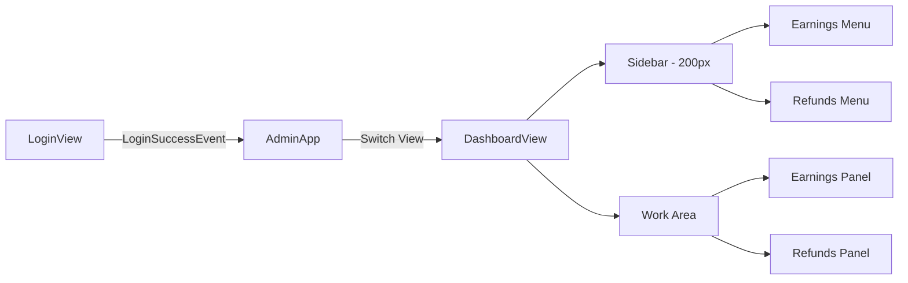

# NEWM Admin Desktop Application

## Overview

NEWM Admin is a desktop application for internal administrators to manage the NEWM platform. Built with Rust and GPUI (GPU-accelerated UI framework from Zed), it provides a performant, native interface for admin operations.

**Tech Stack:**
- **Language:** Rust (2024 edition)
- **UI Framework:** GPUI + gpui-component
- **HTTP Client:** reqwest with async-compat bridge
- **Target Platform:** Desktop (Linux, macOS, Windows)

---

## Current Features

### ✅ Authentication

**Status:** Completed (2026-01-07)

| Feature | Description |
|---------|-------------|
| Admin Login | Email/password authentication against Garage/Studio APIs |
| Environment Selection | Toggle between Garage (dev) and Studio (prod) environments |
| JWT Validation | Verifies `admin: true` claim in JWT before allowing access |
| Password Visibility Toggle | Eye icon to show/hide password input |

**Files:**
- [auth.rs](file:///home/westbam/Development/newm-server/newm-admin/src/auth.rs) — HTTP authentication client
- [jwt.rs](file:///home/westbam/Development/newm-server/newm-admin/src/jwt.rs) — JWT claims parsing
- [login.rs](file:///home/westbam/Development/newm-server/newm-admin/src/views/login.rs) — Login view UI

---

### ✅ Admin Dashboard

**Status:** Completed (2026-01-07)

| Feature | Description |
|---------|-------------|
| Sidebar Navigation | 200px fixed sidebar with menu items |
| View State Management | Event-driven switching from Login → Dashboard via `LoginSuccessEvent` |
| Menu Items | Earnings (`IconName::ChartPie`), Refunds (`IconName::Undo`) |
| Dynamic Work Area | Content changes based on selected menu |
| Mock Statistics Cards | Placeholder cards showing sample data |

**Architecture:**



**Event-Driven View Switching:**
- `LoginView` emits `LoginSuccessEvent` on successful authentication
- `AdminApp` subscribes to this event and switches `AppView` enum from `Login` to `Dashboard`
- This pattern allows decoupled views and clean state management

**Files:**
- [app.rs](file:///home/westbam/Development/newm-server/newm-admin/src/app.rs) — App state, view switching, event subscription
- [dashboard.rs](file:///home/westbam/Development/newm-server/newm-admin/src/views/dashboard.rs) — Dashboard view with sidebar and work area
- [colors.rs](file:///home/westbam/Development/newm-server/newm-admin/src/colors.rs) — Shared color palette

---

## Planned Features

### 🔲 Earnings Management

**Priority:** High

| Requirement | Status |
|-------------|--------|
| List all earnings with pagination | ⬜ Not started |
| Filter by artist, song, date range | ⬜ Not started |
| View earnings details | ⬜ Not started |
| Export earnings data | ⬜ Not started |

### 🔲 Refunds Processing

**Priority:** High

| Requirement | Status |
|-------------|--------|
| List refund requests | ⬜ Not started |
| Approve/reject refunds | ⬜ Not started |
| View refund history | ⬜ Not started |
| Audit trail for refund actions | ⬜ Not started |

### 🔲 Token Refresh

**Priority:** Medium

| Requirement | Status |
|-------------|--------|
| Automatic token refresh before expiry | ⬜ Not started |
| Token storage (secure) | ⬜ Not started |
| Session timeout handling | ⬜ Not started |

---

## Project Structure

```
newm-admin/
├── src/
│   ├── main.rs          # Entry point, window setup
│   ├── app.rs           # App state, view coordinator
│   ├── auth.rs          # Authentication client
│   ├── jwt.rs           # JWT parsing utilities
│   ├── colors.rs        # Shared color palette
│   └── views/
│       ├── mod.rs       # View module exports
│       ├── login.rs     # Login view
│       └── dashboard.rs # Dashboard view
├── Cargo.toml           # Dependencies
├── DESIGN_GUIDE.md      # UI styling reference
└── README.md            # Setup instructions
```

---

## Design System

The application follows NEWM Studio's visual language:

| Element | Specification |
|---------|---------------|
| Background | `#000000` (primary), `#1a1a1a` (surface) |
| Sidebar | 200px fixed width |
| Primary Button | Purple-to-pink gradient (`#C341F0` → `#F53C69`) |
| Text | White (`#ffffff`), secondary gray (`#a1a1aa`) |
| Icons | From gpui-component-assets |

See [DESIGN_GUIDE.md](file:///home/westbam/Development/newm-server/newm-admin/DESIGN_GUIDE.md) for full specifications.

---

## Development Commands

```bash
# Build
cd newm-admin && cargo build

# Run (development)
cd newm-admin && cargo run

# Format code
cd newm-admin && cargo fmt

# Lint
cd newm-admin && cargo clippy
```

---

## Backend API Dependencies

The admin app communicates with the NEWM backend:

| Endpoint | Purpose |
|----------|---------|
| `POST /v1/auth/login` | Admin authentication |
| `GET /v1/auth/refresh` | Token refresh |
| `GET /v1/earnings/*` | Earnings data (planned) |
| `POST /v1/refunds/*` | Refund operations (planned) |

---

## Change Log

| Date | Feature | Description |
|------|---------|-------------|
| 2026-01-07 | Dashboard | Added sidebar nav with Earnings/Refunds, work area panels |
| 2026-01-07 | Auth | JWT admin validation, login view with environment selector |
| 2026-01-06 | Init | Project setup with GPUI, basic login UI |

---

**Status:** 🚧 In Progress  
**Last Updated:** 2026-01-08
